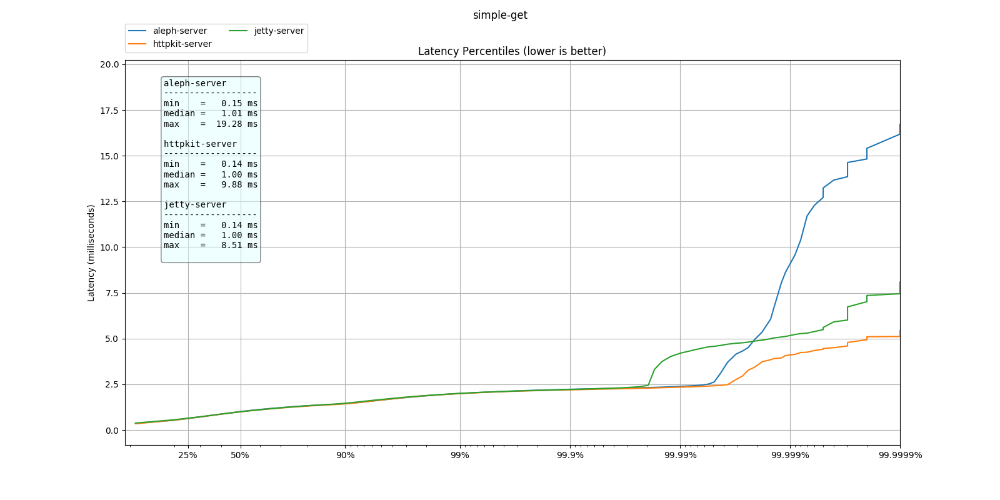

# Clojure HTTP servers benchmark

## Preface

*This work is not intended as a critique to the excellent work that
the library authors have done. Each of the HTTP server libraries
compared here have excellent performance characteristics, they are
very stable and widely used to power loads of HTTP based services all
around the world.*

*This project aims to examine the _long tail_ for a very specific
case.  The case we are going to look here fits the model of a
**service-to-service** communication for a backend service. Where we
assume long running persistent connections, and continuous throughput
of requests.  This particular case is very different from front facing
services with bursty and erratic request throughput.*

*Therefore before jumping into conclusions, please think about the
specifics of your case and if unsure collect metering data and use
this or other test harnesses on your services to verify the behaviour
of these libraries in your particular case.*

The aim of the _long tail_ analysis is to understand the impact of the
library in a vanilla case. Settings and configuration might not apply
in your project when extensive business logic is applied which
substantially change the scenario.

## Results

* See [latest report](./results/2018-05-05_17-05-42/README.md)

* All [reports](./results/)

## How to run

To run need a few packages to be installed:

  * Install the Java JDK
  * Install leingen
  * Install wrk2
  * Install neofetch
  * Install planck-repl

then clone the repo:

    git clone ...
    cd clojure..
    ./bin/run-all.plk

by default it runs a the test for 5 minutes with a warm up time of 10
seconds.  To change these values create a file called `config.edn`
with the following content:

    {:duration "3h" :warm-up-time "120s"}

then run it with:

    ./bin/run-all.plk -c config.edn

The script will build and run all the tests for all the servers.
Once completed the resulting data will be available in the folder `./results`
under a folder with the timestamp of when the test was started.

You can generate the graphs with:

    ./bin/plot-all.sh ./results/yyyy-mm-dd_hh-mm-ss/

You need python3 installed along with a bunch of libraries, to install
them run:

    pip3 install --user pandas matplotlib

## License

Copyright © 2018 Bruno Bonacci - Distributed under the [Apache License v 2.0](http://www.apache.org/licenses/LICENSE-2.0)
