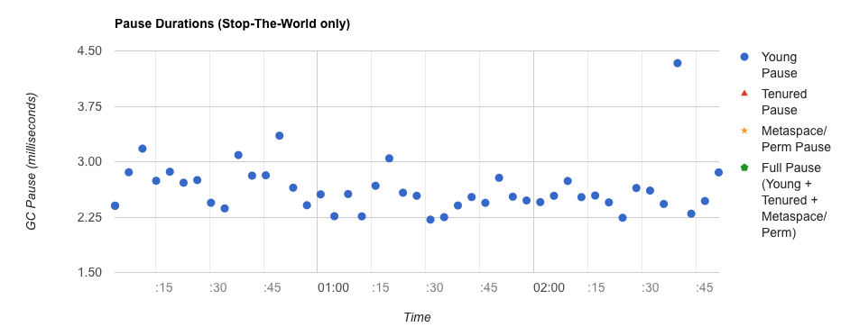
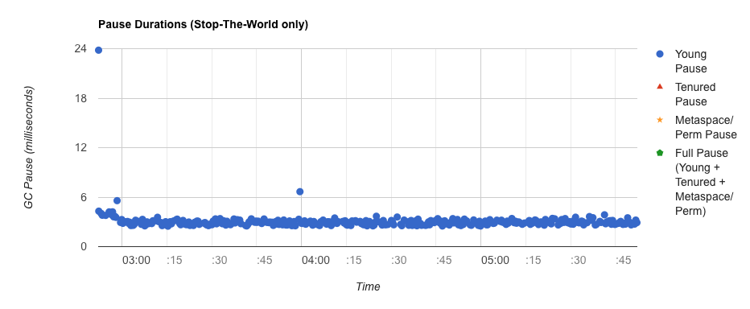
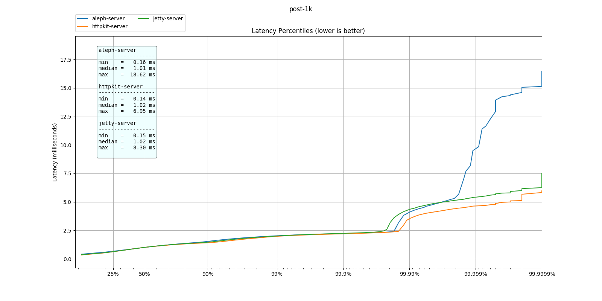

# Benchmark report

## Preface

*This work is not intended as a critique to the excellent work that
the library authors have done. Each of the HTTP server libraries
compared here have excellent performance characteristics, they are
very stable and widely used to power loads of HTTP based services all
around the world.*

*This project aims to examine the _long tail_ for a very specific
case.  The case we are going to look here fits the model of a
**service-to-service** communication for a backend service. Where we
assume long running persistent connections, and continuous throughput
of requests.  This particular case is very different from front facing
services with bursty and erratic request throughput.*

*Therefore before jumping into conclusions, please think about the
specifics of your case and if unsure collect metering data and use
this or other test harnesses on your services to verify the behaviour
of these libraries in your particular case.*

The aim of the _long tail_ analysis is to understand the impact of the
library in a vanilla case. Settings and configuration might not apply
in your project when extensive business logic is applied which
substantially change the scenario.

## Configuration

| Package    | version                                                     |
|------------|-------------------------------------------------------------|
| Clojure    | `[org.clojure/clojure "1.8.0"]`                             |
| aleph      | `[aleph "0.4.4"]`                                           |
| http-kit   | `[http-kit "2.2.0"]`                                        |
| ring-jetty | `[ring/ring-jetty-adapter "1.6.3"]`                         |
| JVM        | `openjdk version "1.8.0_162"`                               |
| OS         | `Ubuntu 16.04.4 LTS x86_64`                                 |
| Hardware   | `AWS EC2 m4.2xlarge - Intel Xeon E5-2686 v4 (8) @ 2.300GHz` |
| GC setting | `-server -Xmx1G -Xms1G -XX:+UseG1GC`                        |


## Tests

Three tests are part of this run:

  - a simple HTTP GET with a HTTP 200 response.
  - a HTTP POST with 1Kib body
  - a HTTP POST with 4Kib body


## Test setup

The loader tool used is [wrk2](https://github.com/giltene/wrk2) to
avoid the [Coordinated
Omission](https://groups.google.com/forum/#!msg/mechanical-sympathy/icNZJejUHfE/BfDekfBEs_sJ)
problem during latency testing.

| Config              | value     |
|---------------------|-----------|
| loader connections  | 500       |
| loader request rate | 500 req/s |
| warmup time         | 2 min     |
| test duration       | 3 hours   |


The handler, for all three servers, look like as follow:

``` clojure
(defn app [{:keys [body]}]
  (let [size (if-not body 0 (count (slurp body)))]
    {:status 200 :body (str "length:" size)}))
```

If the request contains a body it will consume the body and return the
length.  No middleware are used. Default configuration was used. You
can see the code of each server here:

  - [aleph-server](../../aleph-server/) (default config)
  - [httpkit-server](../../httpkit-server/) (default config)
  - [jetty-server](../../jetty-server/) (default config)


## Results

### simple-get test

Here the latency distribution for the test (excluding the warmup)


As you can see they pretty much have the same performance
characteristics up to the 99.9% percentile. After that we see that
while `aleph` and `http-kit` stay on the same latency level the
`ring-jetty` server nearly doubles the latency.  Higher up, at the
99.999% things change again.  The `aleph` latency just start climbing
really sharply while `jetty` and `http-kit` maintain softer
increase. `http-kit` keeps the best profile.

Let's have a look at the GC pauses and the allocation rates:

#### aleph


#### http-kit



#### jetty



Here a summary table of the GC pauses _(source: GCPlot analysis)_:

| server   | 50%ile   | 99%ile    |
|----------|----------|-----------|
| aleph    | 4.072 ms | 17.211 ms |
| http-kit | 2.539 ms | 3.352  ms |
| jetty    | 2.931 ms | 5.577  ms |

As you can see from the graphs the GC collections are all Young
Generation collection, which is expected as all every request dies
when the response is sent (and all the objects are collected).
`aleph` seems to have suffered from initially slower collections but
then it stabilized around the same level as the other ones.  From the
number of points in the scatter plots you can see the number of GC
events. You can quickly see that `jetty` is putting much more pressure
of the Garbage Collector than the other ones. If we take a look to the
allocation rates we can see it in numbers:

| server   | Total allocation (GB) | Allocation Rate (MB/s) |
|----------|----------------------:|-----------------------:|
| aleph    |                19.872 |                   6.33 |
| http-kit |                26.326 |                   2.68 |
| jetty    |               278.370 |                  26.40 |

_(source: GCPlot analysis)_


### HTTP POST with 1Kib and 4Kib body

Here the same test with a HTTP POST this time, with a 1Kib body first, then 4Kib.
The aim is to track verify whether a request body impacts the latency.

  * HTTP POST 1Kib body


  * HTTP POST 4Kib body


As expected there is no much difference between the HTTP POST with
1Kib body and the HTTP POST with 4Kib as well as no much difference
than the HTTP GET without a body. This is what you would expect as the
difference in data transfer for 1Kib to 4Kib on a 28Gbps network
(m4.2xlarge on loopback) is in the order of a microsecond.

# Conclusions

As we seen at the 99.9%ile all three examined HTTP servers have the
same latency. This means that 1 request every thousands (or less) will
be impacted by the decision of which one you choose in your
organization.  If your service performs millions or billions or
requests then it might be necessary to look deeper at the longer part
of the tail.

`http-kit` and `aleph` have a low gc impact compared to `ring-jetty`.
Even if in this particular setup the GC pressure wasn't causing long
pauses mostly due to the fact that the servers were configured with
way more memory than they needed (1Gb); in a real app, with the
additional burden of your business logic, the jetty allocation rate
might cause longer pauses and as consequence longer tail latency.
`http-kit` has a very small footprint in terms of memory usage and
allocation rate, and maintains lower latency throughout the higher
percentile.

The choice of the "best" HTTP server really depends on many other
factors.  Each of the presented HTTP serves have different take on the
abstractions they provide and the features they support, such as async
calls, WebSockets, etc. Things like documentation, examples, community
support were not examined here. Each of the above factors are key in
the decision making process, and only after you choose which API you
want to use and which abstractions are more suitable to express the
behaviour you want, then it is time to look at tail latency and GC
allocation rate.

In the hope that this comparison is useful to someone, or just
inspiration for more detailed research, I'll include all the raw data
and reproducible setup. Happy testing!

If you have any question or comment please open a issue on the GitHub
project.
